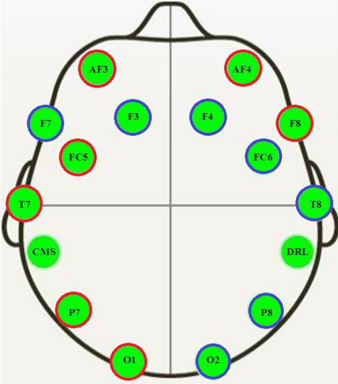

```{r setup, include=FALSE}
knitr::opts_chunk$set(echo = FALSE)
```

```{r initial-loading, include = FALSE}

library(tidyverse)
library(foreign)
library(ggplot2)

data <- read.arff("/Users/vince/OneDrive/Documents/GitHub/Data2SciComm/FinalProject/eyestate.arff")

```

# Research Questions

## Big Research Question
How do **variations** in EEG sensor values between open and closed eye states reflect changes in brainwave activities, and how can this information be used to train machine learning models for **accurately predicting** cognitive states like attention and mental fatigue?

## Little Research Question
Which sensors are **most predictive** of cognitive state during open and closed eye states?

# Data Source

The dataset used in this study is the *EEG Eye State* database from the UC Irvine Machine Learning Repository. It contains EEG recordings from **14** different EEG sensors, in which participants were asked to perform tasks with either their eyes **open** (0) or **closed** (1).

## Sensors
- Frontal electrodes: decision-making, emotions, attention
- Fronto-Central electrodes: motor control 
- Temporal electrodes: hearing, language recognition, memory
- Parietal electrodes: touch, temperature, pressure, pain
- Occipital electrodes: visual processing



# AF3 Electrode Analysis 

```{r cleaning-data, include = FALSE}

#there are some outliers in the data set that are affecting my plots
#taking out the outliers 

#setting ranges for the quartiles
Q1 <- quantile(data$AF3, 0.5)
Q3 <- quantile(data$AF3, 0.95)
IQR <- Q3 - Q1

#set the bounds
lower_bound <- Q1 - 1.5 * IQR
upper_bound <- Q3 + 1.5 * IQR

#hold the cleaned data in new variable
data_cleaned <- data[data$AF3 >= lower_bound & data$AF3 <= upper_bound, ]

```


```{r plot, echo = FALSE}

data_cleaned %>% 
  ggplot(aes(x = eyeDetection, y = AF3, fill = eyeDetection)) +
  geom_boxplot() +
  labs(title = "EEG Sensor (AF3) Distribution by Eye State",
       x = "Eye Detection",
       y = "EEG Signal Value (μV)") + 
  scale_fill_manual(name = "Eye State",
                    labels = c("Open (0)", "Closed (1)"),
                    values = c("red", "lightblue")) +
  theme_minimal()

```
